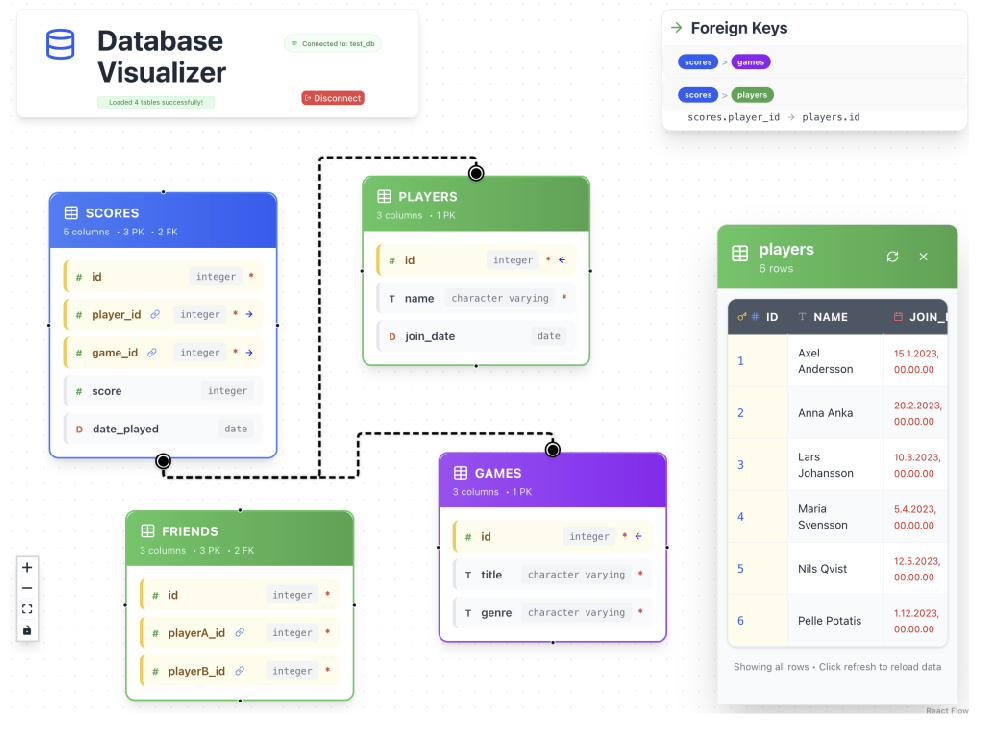

# Database Visualizer

A web app for visualizing PostgreSQL database schemas, relationships, and data in real time. Built to help backend developers and visual learners understand and explore their databases with clarity and ease.

## Why This Project?

As a fullstack developer student, I often hit personal roadblocks working with PostgreSQL databases. Being a visual learner, I found it difficult to picture foreign key relationships, table structures, and actual data values. Existing tools like PGAdmin felt clunky and unintuitive, and I couldn't find any alternatives that truly fit my needs.

So, I created this web app—with the help of GitHub Copilot—to solve a real problem: to visually see, in real time, how my databases work. Now, I can instantly understand which foreign keys relate (with color-coded arrows), how tables connect (flowcharts with color-coded tables), and inspect table data with a single click.

## Tech Stack & Choices

**Frontend:**

- React (with Vite) — Fast, component-based UI development.
- Tailwind CSS — Utility-first styling for rapid, consistent, and responsive design.
- React Flow — Specialized for interactive, node-based diagrams (perfect for ERDs).
- Lucide React — Modern, open-source icon library.

**Backend:**

- Node.js & Express — Simple, robust server and REST API framework.
- pg (node-postgres) — Reliable PostgreSQL client for Node.js.
- dotenv, cors — For environment management and secure cross-origin requests.

**Database:**

- PostgreSQL — Powerful, open-source relational database.

- **Interactive ER Diagrams**: Tables are displayed as draggable, color-coded cards.
- **Color-Coded Relationships**: Foreign key relationships are shown with clear, colored arrows.
- **Real-Time Data Exploration**: Click any table to view its actual data in a side panel.
- **Responsive UI**: Works on desktop and tablet devices.
- **Modern UX**: Built with React, Tailwind CSS, and React Flow for a clean, professional look.

## How to Use

### Getting Started

1. **Connect to Database**: Enter your PostgreSQL connection details (host, port, database name, username, password)
2. **View Schema**: Once connected, the app automatically loads and displays your database schema as an interactive diagram

### Navigation & Controls

- **Zoom & Pan**: Use mouse wheel to zoom in/out, click and drag to pan around the diagram
- **Fit to View**: Use the navigation controls in the bottom-left corner to fit the entire schema to your viewport size
- **Reset View**: Click the "fit view" button (□) in the controls to center and scale the diagram optimally

### Interacting with Tables

- **Drag Tables**: Click and drag any table card to reposition it for better organization
- **View Table Data**: Click on any table card to open a data panel showing the actual records from that table
- **Table Colors**: Tables are automatically color-coded by type/category for easy visual identification

### Database Features

- **Refresh Schema**: Click the orange **Refresh** button in the header to manually update the diagram if your database structure changes
- **Foreign Key Relationships**: Relationship arrows connect related tables, showing foreign key connections
- **Foreign Key List**: Use the foreign key list panel (top-right) to:
  - See all foreign key relationships in your database
  - Click on relationship buttons to highlight the specific connection string
  - Navigate between related tables quickly

### Status & Connection

- **Connection Status & info**: The green "Connected" indicator shows your current database connection status and which database you're connected to in the header
- **Disconnect**: Use the red **Disconnect** button to safely close the database connection and return to the login screen

### Tips for Best Experience

- **Organize Your View**: As the page loads, click the "fit view" on the navigation panel. Drag tables to create logical groupings that make sense for your workflow
- **Use Foreign Key List**: Great for get a quick understanding of relationships (also look for the color coded arrows in the tables).
- **Data Exploration**: Click through different tables to explore your actual data alongside the schema structure
- **Regular Refresh**: Use the refresh button after making schema changes in other tools to keep the visualization up-to-date

## How It Was Made

1. **Planning**: I started by writing an abstract of my exact needs—both frontend and backend requirements, as well as design and UX goals.
2. **Developer Instructions**: Through discussions and deeper questions with Copilot, I generated a detailed developer instruction document (`copilot-instructions.md`) to guide the build process.
3. **Step-by-Step Development**: I worked through a detailed todo list, iteratively improving the app and adding features as new ideas emerged.
4. **Continuous Learning**: Each step gave me a better understanding of my databases and how to visualize them effectively. And I learned more about how co-pilot can be used with a "copilot_instructions.md first approach".

## Takeaways

- Visual tools makes learning and working with databases much easier for visual thinkers.
- Building your own tools can be a great way to overcome learning roadblocks.
- Copilot when used with care and strict guidance and supervision, has good potential as a powerful assistant for planning, scaffolding, and iterating on production of assitive technology. In no means is it an replacement for a human developer.

## Getting Started

1. **Clone the repository**
2. **Set up the backend and frontend** (see `copilot-instructions.md` for details)
3. **Configure your PostgreSQL connection**
4. **Start both servers and open the app in your browser**

## Credits

- Built by /TrooperLooper with GitHub Copilot
- Inspired by the need for better, more visual database tools

---

For more details, see the full planning and developer guide in [`copilot-instructions.md`](./copilot-instructions.md).
